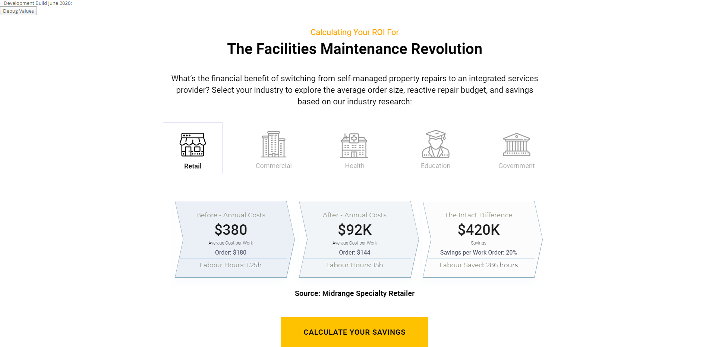
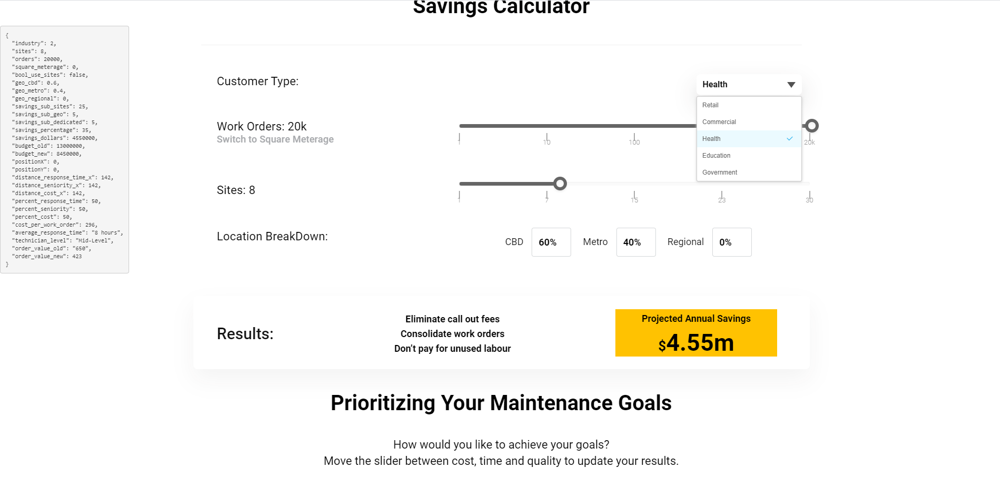
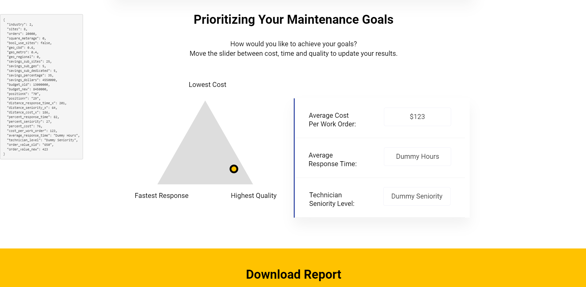
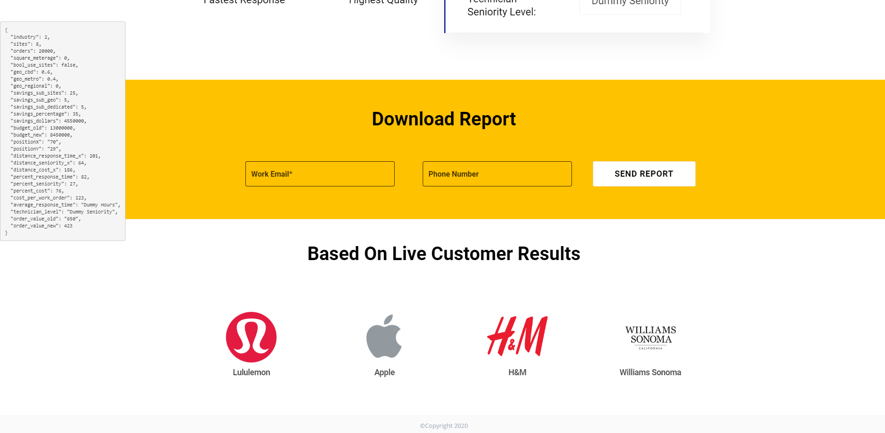

# Wyn Calculator System with PDF and Draggable

## Build Instructions
1. npm build
1. npm start

## Active Branches
1. Master -> Internal Demo (Calculator 2)
1. Intact -> Intact Customer Instance (Calculator 1)

